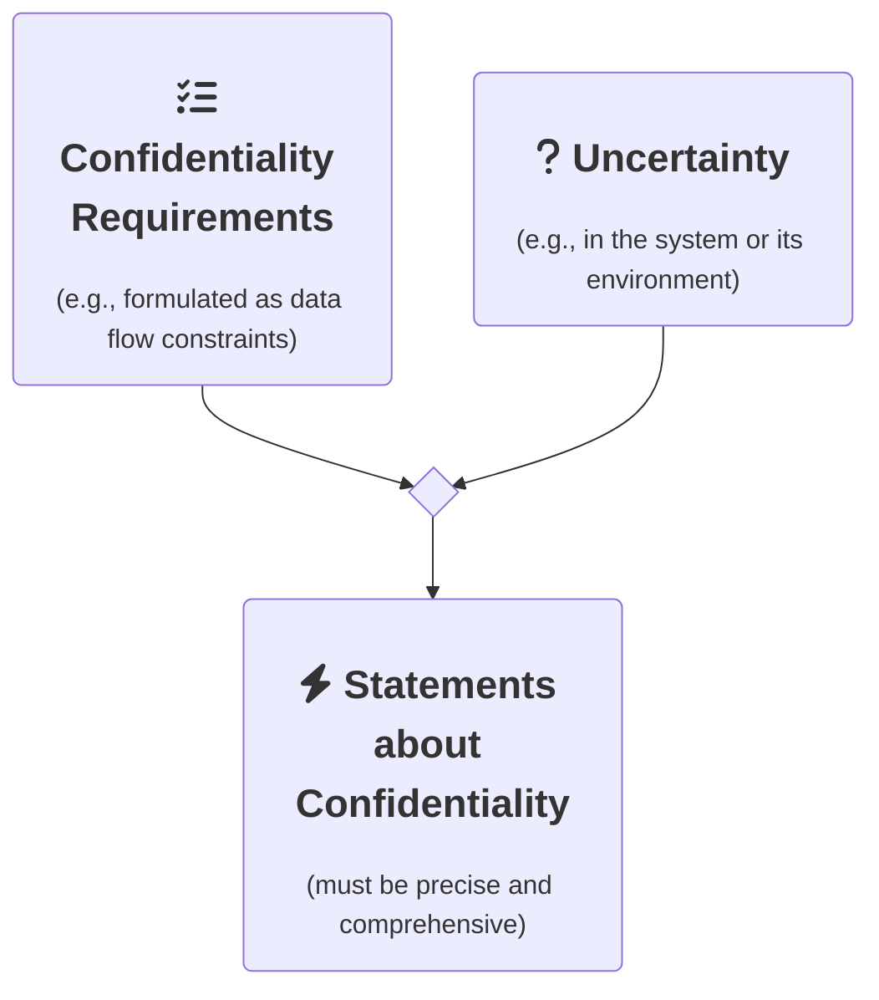

 
	

# Architecture-Based Uncertainty-Aware Confidentiality Analysis

**ABUNAI** is a research approach for confidentiality analysis under uncertainty.
Using software architectural modeling, we combine design time uncertainty impact analysis with data flow-based confidentiality analysis.
This enables both precise and comprehensive statements about the confidentiality of software-intensive systems with respect to uncertainty in the system and its environment.

The project's name is inspired by the Japanese word **あぶない (abunai)** which translates to dangerous, risky, or uncertain.
The research project is headed by [Sebastian Hahner](https://dsis.kastel.kit.edu/staff_sebastian_hahner.php) at the DSiS group, KASTEL Institute, Karlsruhe Institute of Technology (KIT).

More information can be found in these key publications:

* S. Hahner, R. Heinrich, and R. Reussner, "Architecture based Uncertainty Impact Analysis to Ensure Confidentiality", in *18th Symposium on Software Engineering for Adaptive and Self-Managing Systems (SEAMS)*, IEEE/ACM, 2023, doi: [10.1109/SEAMS59076.2023.00026](https://doi.org/10.1109/SEAMS59076.2023.00026)
* S. Hahner, et al., "Model-based Confidentiality Analysis under Uncertainty", in *2023 IEEE 20th International Conference on Software Architecture Companion (ICSA-C)*, IEEE, 2023, doi: [10.1109/ICSA-C57050.2023.00062](https://doi.org/10.1109/ICSA-C57050.2023.00062)
* S. Hahner, S. Seifermann, R. Heinrich, and R. Reussner, "A Classification of Software-Architectural Uncertainty Regarding Confidentiality", in *International Conference on E-Business and Telecommunications (ICETE)*, Springer, 2021, doi:  [10.1007/978-3-031-36840-0_8](https://doi.org/10.1007/978-3-031-36840-0_8)

## Idea

ABUNAI is based on software architectural modeling using [Palladio](https://www.palladio-simulator.com/). 
We analyze and integrate the effect of uncertainty in already [existing](https://github.com/PalladioSimulator/Palladio-Addons-DataFlowConfidentiality-Analysis) design time confidentiality analysis. 
The first step is the **classification** of identified uncertainty sources. 
Afterward, the uncertainty sources can be propagated and their effect is predicted using **Uncertainty Impact Analysis (UIA)**.
The results of this analysis can then be used in **uncertainty-aware confidentiality analysis**.

## Structure

The repositories of this organization contain all relevant ABUNAI artifacts:

* [Uncertainty Impact Analysis](https://github.com/abunai-dev/UncertaintyImpactAnalysis) contains the prototype implementaion of an analysis to predict the impact of uncertainty on confidentiality
* [Case Study: Corona Warn App](https://github.com/abunai-dev/CaseStudy-CoronaWarnApp) contains a case study to evaluate our analyses using the German Corona Warn App
