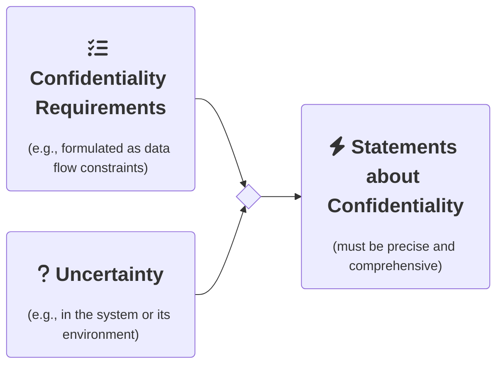

 
	

# Architecture-Based Uncertainty-Aware Confidentiality Analysis

**ABUNAI** is a research approach for confidentiality analysis under uncertainty.
Using software architectural modeling, we combine design time uncertainty impact analysis with data flow-based confidentiality analysis.
This enables both precise and comprehensive statements about the confidentiality of software-intensive systems with respect to uncertainty in the system and its environment.

The project's name is inspired by the Japanese word **あない (abunai)** which translates to dangerous, risky, or uncertain.
The research project is headed by [Sebastian Hahner](https://dsis.kastel.kit.edu/staff_sebastian_hahner.php) at DSiS, KASTEL Institute, Karlsruhe Institute of Technology (KIT).

More information can be found in these key publications:

* S. Hahner, R. Heinrich, and R. Reussner, "Architecture based Uncertainty Impact Analysis to ensure Confidentiality", in *18th Symposium on Software Engineering for Adaptive and Self-Managing Systems (SEAMS)*, IEEE/ACM, 2023, accepted, to appear.
* S. Hahner, S. Seifermann, R. Heinrich, and R. Reussner, "A Classification of Software-Architectural Uncertainty regarding Confidentiality", in *International Conference on E-Business and Telecommunications (ICETE)*, Springer, 2023, accepted, to appear.
* S. Hahner, et al., "Model-based Confidentiality Analysis under Uncertainty", in *2023 IEEE 20th International Conference on Software Architecture Companion (ICSA-C)*, IEEE, 2023, accepted, to appear.

## Idea

